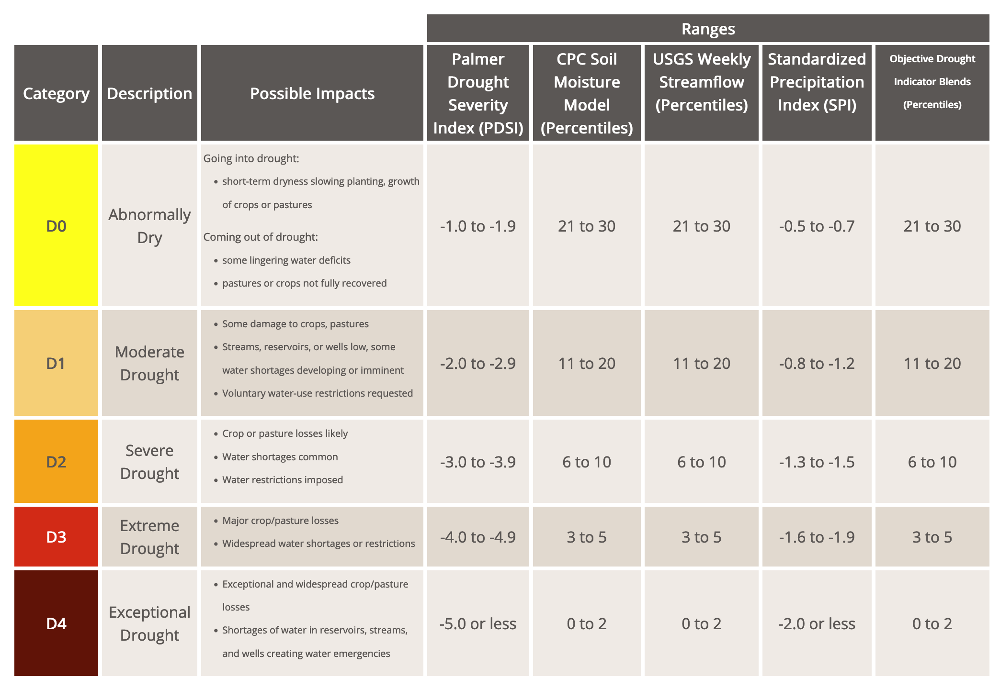
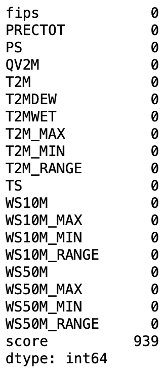
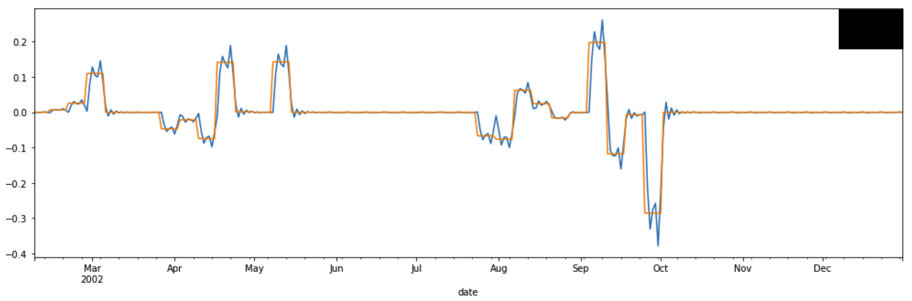
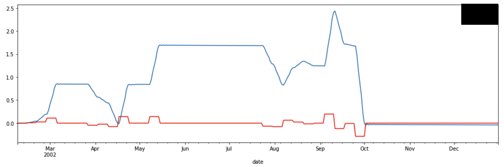
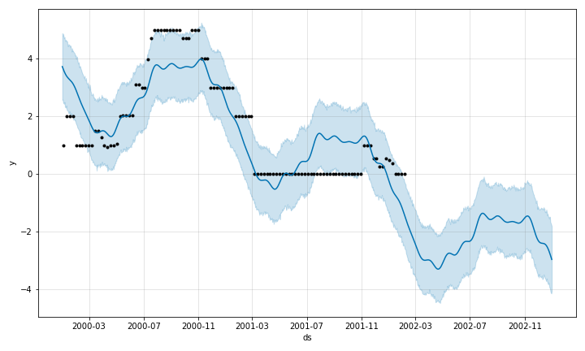

# Prediction of Drought Levels

## Introduction

In the last years, climate change has become a more popular topic in the worldwide news. It affects our lives in multiple areas. One popular effect that it has is global warming. It is the effect that, due to human-induced greenhouse gas emissions, the average temperature will rise in the lower levels of the atmosphere[1].    
With the rise of the average temperature drought periods will happen more often. This is especially problematic for countries whose average temperature is already higher than the average temperature in Germany.  
The effect is particularly bad for agriculture.  
The weather forecast is often only accurate for the next few days. What if there was a method to predict the rough drought level for a longer timespan? This is where our project comes into play.

## Dataset

We used a Dataset from Kaggle which contained weather data from the US from the years 2000 until 2020[2]. In the dataset, the feature variable was a score ranging from 0 (no drought) to 5 (D4). D4 is the highest level of drought. There are six levels of drought possible[3]. This dataset was constructed with data from the US Drought Monitor and the NASA POWER Project.  
The U.S. Drought Monitor is a map released every Thursday, showing parts of the U.S. that are in drought. The map uses five classifications:  
abnormally dry (D0), showing areas that may be going into or are coming out of drought, and four levels of drought: moderate (D1), severe (D2),  
extreme (D3) and exceptional (D4). The NASA POWER Project provides solar and meteorological data sets from NASA research for support of renewable energy, building energy efficiency and agricultural needs.

## Method

### Exploratory data analysis

In the Kaggle dataset, we were given a "train time series" which contains roughly 16 years of data. Due to the sheer size of this time series, we decided to cut the dataset down to 2 years for our first explorations and the first model testings. So we did all the following explorations with the years 2000 until 2002.  
The dataset contains 21 different columns, with one of them being a date column, which we used as the index column in our exploration.  
The columns contain the following information:

| Indicator   | Description                           |
| ----------- | ------------------------------------- |
| WS10M_MIN   | Minimum Wind Speed at 10 Meters (m/s) |
| QV2M        | Specific Humidity at 2 Meters (g/kg)  |
| T2M_RANGE   | Temperature Range at 2 Meters (C)     |
| WS10M       | Wind Speed at 10 Meters (m/s)         |
| T2M         | Temperature at 2 Meters (C)           |
| WS50M_MIN   | Minimum Wind Speed at 50Meters (m/s)  |
| T2M_MAX     | Maximum Temperature at 2 Meters (C)   |
| WS50M       | Wind Speed at 50 Meters (m/s)         |
| TS          | Earth Skin Temperature (C)            |
| WS50M_RANGE | Wind Speed Range at 50 Meters (m/s)   |
| WS50M_MAX   | Maximum Wind Speed at 50 Meters (m/s) |
| WS10M_MAX   | Maximum Wind Speed at 10 Meters (m/s) |
| WS10M_RANGE | Wind Speed Range at 10 Meters (m/s)   |
| PS          | Surface Pressure (kPa)                |
| T2MDEW      | Dew/Frost Point at 2 Meters (C)       |
| T2M_MIN     | Minimum Temperature at 2 Meters (C)   |
| T2MWET      | Wet Bulb Temperature at 2 Meters (C)  |
| PRECTOT     | Precipitation (mm day-1)              |

Plus, three additional columns contain non-meteorological data:

| Indicator | Description                                                                                                |
| --------- | ---------------------------------------------------------------------------------------------------------- |
| date      | Date of the measurement (Format YYYY-MM-DD)                                                                |
| fips      | US county FIPS code. see: https://www.nrcs.usda.gov/wps/portal/nrcs/detail/national/home/?cid=nrcs143_0136 |
| score     | Measure of drought ranging from 0 (no drought) to 5 (D4, see description)                                  |

But first, let's take a look at the score variable and its description.
There are six levels of drought according to the U.S. Drought Monitor[3][QUELLE DROUGHT MONITOR].

In the dataset, these levels are a numerical feature. So 1=D0, 2=D1, etc..
The plotted feature (over 3 years 2000-2002) looks like this:

  
If we take a look at a smaller period we notice a problem, we have missing values in our data.  

### Missing values

The missing values were a problem at first because machine learning models don't work with data that contains NaN values (NaN = not a number). Taking a look at the NaN values in all columns (of the years 2000-2002) we get the following result:

We see that the score column contains 939 missing values. The total number of values in this data frame is 1096, which means that roughly 86% of the data is missing. This means that we can't just delete the rows which contain missing data (this is a common way to deal with missing data).  
Taking a closer look at the description of the dataset on Kaggle, we can see that the missing values make sense. The score feature is a feature that is only measured once a week. So we have one data point and then 6 missing data points.  
But we still had to find a way to deal with the missing data. Another common tactic is to compute the mean of all the entries in the column, and then the missing values all get filled with the mean. This made no sense in our case, due to the nature of the dataset and the mass of missing values. It also would have distorted the dataset way too much.  
  
The approach we choose was 'Interpolation'. In specific, we used the 'time' method. This method takes two values of the score and fills the values between them with values that make more sense.
When we do this we get a much more promising result:  
  
With the interpolated values we were able to start trying out different models using different approaches.

### Models and results

We tried different approaches. Since this is a time series forecasting problem, where you want to predict the value of a target variable over a time period. For time series forecasting there are two categories of models that one can use. More specific we have a univariate time series problem. This means that we want to predict one variable, in our case the score variable.  
For univariate time series, there are "traditional time series models", like ARIMA, SARIMAX or Prophet. Also, there are "machine learning models" like linear regression, logistic regression and random forest, to name a few.  
In the first stage of our project, the plan was, that everyone tries a different approach on a subset of the whole dataset (the years 2000-2002) and then we will evaluate which model performs best. After that, we wanted to use the best performing model to train on the whole dataset for the final prediction.  
The models we then tried were Exponential Smoothing, ARIMA, Random Forest Regression, Prophet and an LSTM Neural Network.  
**_Arima_**  
We had some problems with the ARIMA model since we had to do differentiate the data since it was not stationary. This is a step you have to do, in order to create an ARIMA model[4]. The predictions for the differenced data were promising. But if we transformed this data back the predictions weren't that good, like the plots, show:  

  
_In the upper plot the blue line is the differenced score value and the other line is the ARIMA prediction_  
_In the bottom plot the blue line is the score value and the other line is the ARIMA prediction_  
On the differenced data the model predicted quite good, but after transforming the data back the predictions were quite bad. 
So we decided to continue with another approach.  
**_Prophet_**  
Prophet is a model which was built by Facebook. It makes time series forecasting simple.  
You have to provide it with a date column and the target variable column, which you want to predict.  
We did this, but the problem was that the score variable (our target variable) is in the range from 0 to 5. In the Prophet model, there is no way to set boundaries to the predictions, so the model predicted the following:  
  
From a prediction side, the predictions make sense, but in the context of our problem, they make no sense because there is no Drought Level that matches negative values. Due to that reason, we decided to not continue with the prophet model.  
**_LSTM Neural Network_**  
At the time this article was written, we did not hear back from the team member who was responsible for this model. So we sadly have nothing to present on this approach.  
**_Random Forest_**  
The model that we finally decided to use was a Random Forest Regression model. Since this is a machine learning model, we have to transform our time series to a supervised learning problem first.  
A supervised learning problem is a problem where we have one target/dependent variable, that we want to predict based on one or more independent variables.  
To transform this time series into a supervised learning problem we have to create a new variable, which becomes the target variable, which is the shifted score variable. It is shifted by one day. This sounds more complex than it is.  
Let's take a look at this example:  
Let's consider this to be the first five values of our score variable:

| score |
| ----- |
| 1     |
| 2     |
| 3     |
| 4     |
| 5     |

Then the shifted target variable looks like this:

| score | target |
| ----- | ------ |
| 1     | 2      |
| 2     | 3      |
| 3     | 4      |
| 4     | 5      |
| 5     | NaN    |

After that, we can start by fitting the model to the data and make predictions. The first predictions on a subset of the data (2000-2002) looked very promising.  

A concern we had was data leakage. This is, in simple terms, when the model has access to data, which it should not have had and makes predictions based on that. The problem is, that these models perform great in testing, but poorly in the "real world".  
So we picked some random months from another year of data that the model had never seen and made predictions. These predictions looked also really good.  

So we were able to try the model on the whole dataset.
**_Expnentail smooothing _** 
This function is using rule of thumb, by averaging the past results and assign them to an equal weight.
As in the case of the other approaches we had as well a problem with the datase and it´s missing values. We also tried fixing this problem by applying the interpolation function on the dataset. This did not fix all problems and we decided against this method, becouce of it´s bad precision.

## Project Results

The next step was to train the model on the whole training set. After that we imported the test set and made predictions, which you can see here:  
  
After that, we also had a validation set. So we could make another test with the model. The predictions you can see here:  

But there is a **disclaimer**:  
In the different datasets (training, test and validation) there were different fips numbers. The datasets were ordered in the following way.  

| fips | date       |
| ---- | ---------- |
| 1001 | 01.01.2000 |
| 1001 | 02.01.2000 |
| ...  | ...        |
| 1001 | 31.12.2016 |
| 1002 | 01.01.2000 |
| 1002 | 02.01.2000 |
| ...  | ...        |
| 1002 | 31.12.2016 |
| 1003 | 01.01.2000 |
| ...  | ...        |

But for the purpose of don't mess up with the time series we trained, tested and validated the model only for the fips number "1001".  
But it should work as good for the other numbers because before we fit the model we deleted the fips column. We did this because it didn't have any effect on the data.

## Conclusion

We were able to get some good results in predicting the drought score for the regions. But there could be done more. For example, it is possible to try a Neural Network approach to this problem. On Kaggle there is an example where an LSTM (Long-short term memory) Neural Network was used[5]. Another approach could be to instead of a regression model is to use a classification model. So that you feed the meteorological data to the model and it predicts which drought category this would be. This is a great example of data that can be used in different ways.

## Team

Doriel Habasllari - Mentor  
Ole Seifert - Data Science  
Lena Engler - Data Science  
Yingen - Data Science  
Hannes Bernhard - Data Science

## References

[1] [Wikpedia](https://en.wikipedia.org/wiki/Climate_change)  
[2] [Kaggle Dataset](https://www.kaggle.com/cdminix/us-drought-meteorological-data)  
[3] [Drought Monitor](https://droughtmonitor.unl.edu/About/WhatistheUSDM.aspx)  
[4] [ARIMA](https://machinelearningmastery.com/arima-for-time-series-forecasting-with-python/)  
[5] [Kaggle LSTM Model](https://www.kaggle.com/cdminix/lstm-baseline)  
[6] [Github Repository](https://github.com/TechLabs-Aachen-e-V/SoSe-21-Team-10_Main)
